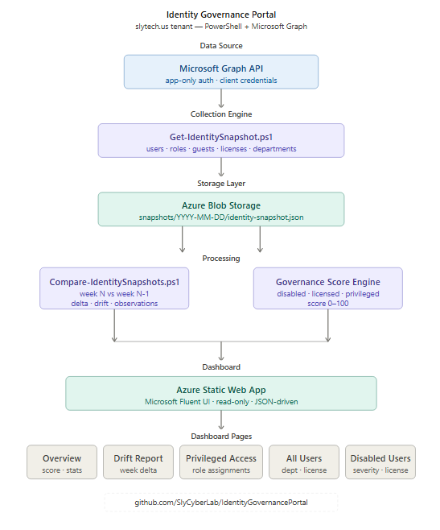
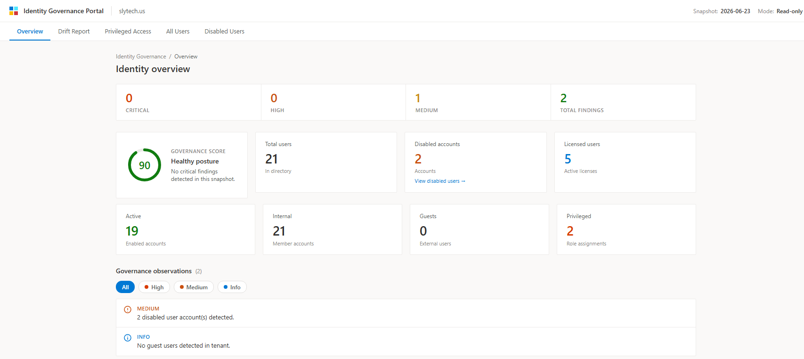
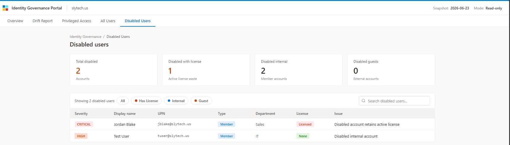
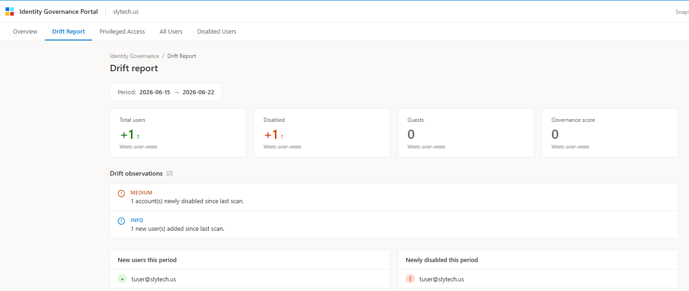
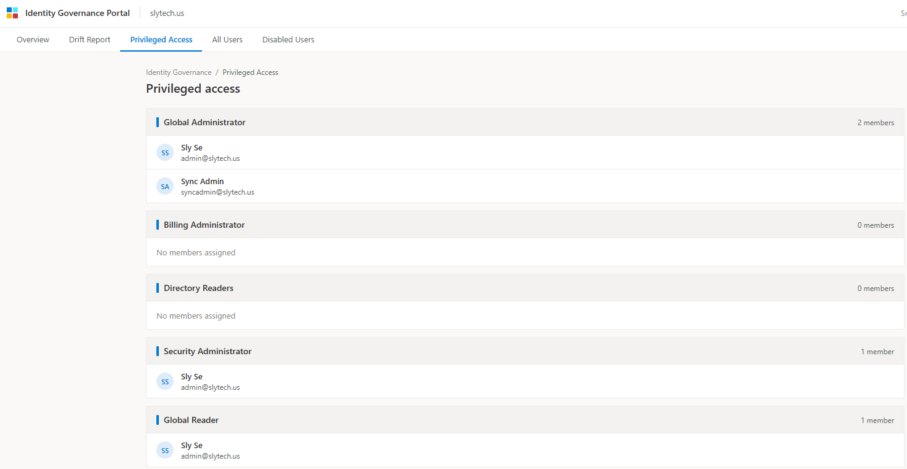

# Identity Governance Portal

A lightweight, read-only identity governance and drift monitoring system built on top of the [Identity Lifecycle Automation](https://github.com/SlyCyberLab/IdentityLifecycleAutomation) project. This system provides weekly identity security visibility, detects changes over time, and highlights privileged access risks across a Microsoft 365 / Entra ID tenant.

> Built as a portfolio project demonstrating real-world IAM governance patterns using Azure-native services and Microsoft Graph API.

---

## Overview

Most identity automation projects stop at provisioning and deprovisioning. This project adds the observability layer on top: a governance and drift detection system that answers the questions a security team actually cares about week over week.

- Who has privileged access right now?
- Which accounts are disabled but still holding active licenses?
- What changed since last week?
- Is our identity posture improving or declining?

---

## Architecture


**Design principles:**
- Read-only, no remediation actions
- Azure-native, near-zero cost
- JSON snapshots stored week-by-week for historical comparison
- Microsoft Fluent design language for dashboard UI

---

## Features

### Identity Overview
- Governance health score (0-100) calculated from tenant posture
- Total, active, disabled, internal, guest, privileged, and licensed user counts
- Findings summary bar (Critical, High, Medium, Total)
- Governance observations with severity filter

### Drift Report
- Week-over-week delta comparison across all identity metrics
- New users, removed users, newly disabled accounts
- Privileged role assignment changes
- Governance score trend

### Privileged Access Monitoring
- All active directory role assignments
- Member count per role
- User principal names and display names per role

### All Users
- Full directory user list with department, license status, and account type
- Internal vs Guest toggle filter
- Live search by name or UPN

### Disabled Users Drilldown
- Severity-ranked disabled account list (Critical, High, Medium)
- Flags disabled accounts still holding active licenses
- Department and account type context per disabled user
- Filter by license status, account type, or search by name

---

## Scripts

| Script | Purpose |
|---|---|
| `scripts/test-graph-queries.ps1` | Phase 1: Validates Graph API connectivity and permissions |
| `scripts/Get-IdentitySnapshot.ps1` | Phase 2: Collects weekly identity snapshot and writes JSON |
| `scripts/Compare-IdentitySnapshots.ps1` | Phase 3: Compares two snapshots and generates drift report |

---

## Graph API Permissions Required

| Permission | Purpose |
|---|---|
| `User.Read.All` | Read all user profiles and account status |
| `AuditLog.Read.All` | Required for sign-in activity data |
| `Reports.Read.All` | MFA registration details |
| `RoleManagement.Read.All` | Directory role assignments |
| `Directory.Read.All` | Directory objects, guests, group memberships |
| `UserAuthenticationMethod.Read.All` | Authentication method details |

All permissions require **Application** type with **admin consent** granted.

---

## Governance Score

The governance score (0-100) is calculated at snapshot time based on tenant posture:

| Finding | Score Impact |
|---|---|
| Any disabled accounts exist | -10 |
| Guest accounts exceed 5 | -10 |
| Privileged user count exceeds 2 | -20 |
| Each disabled user with active license | -10 per account |

---

## Setup

### Prerequisites
- Microsoft 365 / Entra ID tenant
- Azure App Registration with required permissions
- PowerShell 5.1 or later

### 1. App Registration
Create an app registration in Entra ID named `identity-governance-portal` with Application permissions listed above. Grant admin consent.

### 2. Configure credentials
Create a `.env` file at the project root:
```
TENANT_ID=your-tenant-id
CLIENT_ID=your-client-id
CLIENT_SECRET=your-client-secret
```

### 3. Run the snapshot collector
```powershell
cd scripts
.\Get-IdentitySnapshot.ps1
```

### 4. Run the drift engine
```powershell
.\Compare-IdentitySnapshots.ps1
```

### 5. Launch the dashboard
```powershell
cd ..
npx serve .
```
Open `http://localhost:3000/dashboard/index.html`

---

## Screenshots

### Overview


### Disabled Users Drilldown


### Drift Report


### Privileged Access


---

## Roadmap

- [ ] Azure Function timer trigger for automated weekly snapshots
- [ ] Azure Blob Storage integration for cloud-hosted snapshots
- [ ] Azure Static Web App deployment
- [ ] Email governance digest via Logic App
- [ ] Trend charts (4-week rolling view)
- [ ] Security group membership tracking for disabled accounts

---

## Related Projects

- [Identity Lifecycle Automation](https://github.com/SlyCyberLab/IdentityLifecycleAutomation) — The automation layer this project builds on top of

## Blog Post

Coming soon on [blog.slytech.us](https://blog.slytech.us)

---

## Author

**Sly Severe** — IT Administrator transitioning into Cloud and Security Engineering  
[blog.slytech.us](https://blog.slytech.us) · [GitHub: SlyCyberLab](https://github.com/SlyCyberLab)
