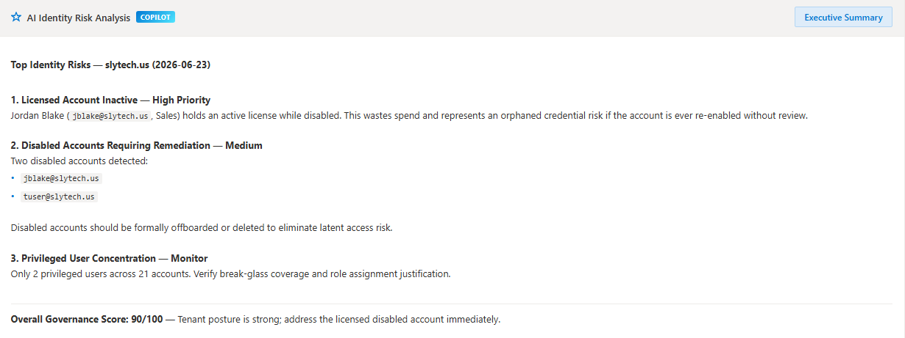
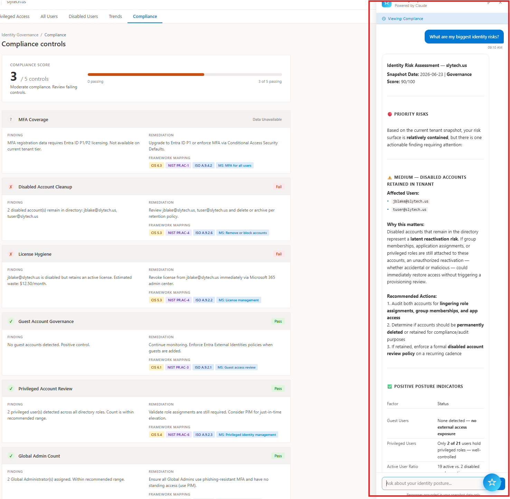
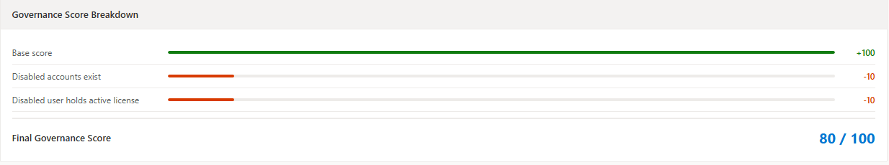
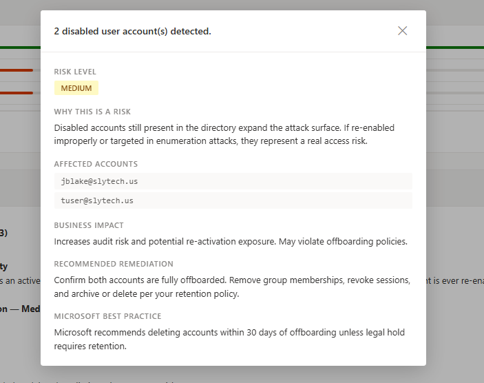
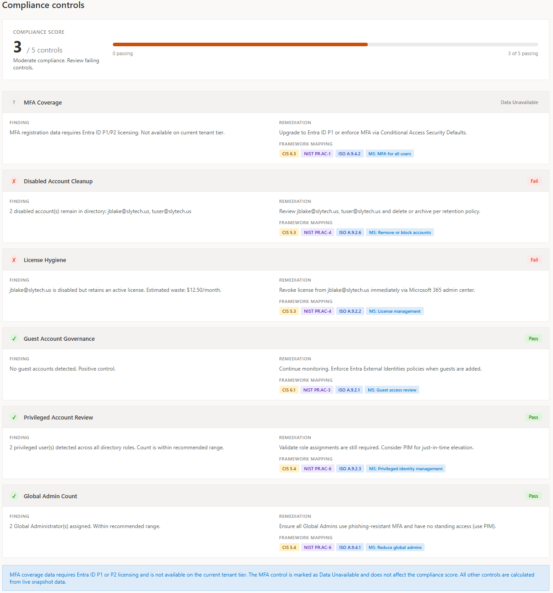
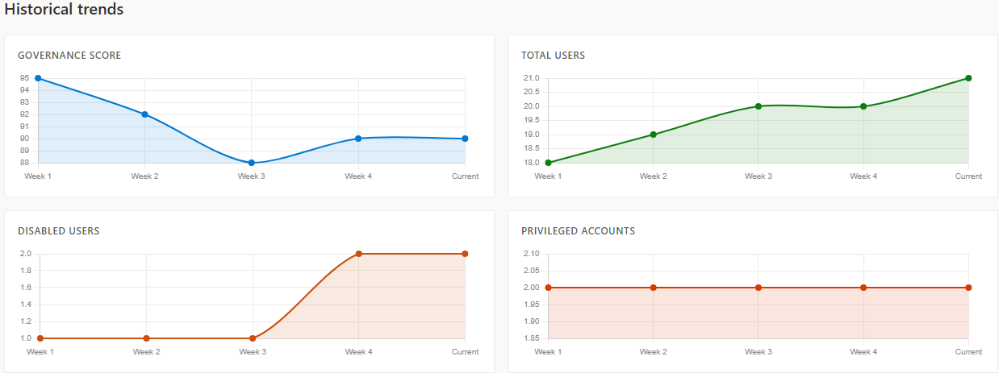

# Identity Governance Portal

A lightweight, read-only identity governance and drift monitoring system built on top of the [Identity Lifecycle Automation](https://github.com/SlyCyberLab/IdentityLifecycleAutomation) project. This system provides weekly identity security visibility, detects changes over time, highlights privileged access risks, and includes an AI-powered Copilot that answers natural language questions about your tenant posture.

> Built as a portfolio project demonstrating real-world IAM governance patterns using Azure-native services, Microsoft Graph API, and Anthropic Claude.

---

## Overview

Most identity automation projects stop at provisioning and deprovisioning. This project adds the observability layer on top: a governance and drift detection system that answers the questions a security team actually cares about week over week.

- Who has privileged access right now?
- Which accounts are disabled but still holding active licenses?
- What changed since last week?
- Is our identity posture improving or declining?
- Why did the governance score change?

The AI Copilot answers all of these in plain English, grounded strictly in your tenant snapshot data.

---

## Architecture


**Design principles:**
- Read-only, no remediation actions
- Azure-native, near-zero cost
- JSON snapshots stored week-by-week for historical comparison
- Microsoft Fluent design language for dashboard UI
- AI Copilot routed through Azure Function to keep API keys off the frontend

---

## Features

### Executive Health Bar
- Identity Health status (Healthy / At Risk / Critical)
- Governance Score at a glance
- Critical findings count
- Week-over-week user delta
- Estimated license waste in dollars per month
- Highest risk account surfaced immediately

### Identity Overview
- Governance health score (0-100) with transparent breakdown showing exact deductions
- Total, active, disabled, internal, guest, privileged, and licensed user counts
- Findings summary bar (Critical, High, Medium, Total) — clickable to filter
- Governance observations with severity filter and clickable detail panels

### AI Identity Risk Analysis
- Auto-generated risk analysis on page load using Claude
- Grounded strictly in snapshot data — no hallucination
- Clickable finding detail panels with risk level, business impact, remediation steps, and Microsoft best practice guidance

### AI Identity Copilot
- Floating chat panel accessible from any page
- Context-aware: automatically injects current page data into every question
- Suggested prompts per page
- Analyze Current Page quick action
- Executive Summary one-click generation
- Conversation history within session
- Powered by Claude via Azure Function proxy

### Governance Score Breakdown
- Transparent score calculation showing each deduction rule
- Visual bar for each penalty
- Final score displayed clearly

### Drift Report
- Week-over-week delta comparison across all identity metrics
- New users, removed users, newly disabled accounts
- Privileged role assignment changes
- Color-coded delta cards (green for improvements, red for regressions)

### Privileged Access Monitoring
- All active directory role assignments
- Member count per role with avatar initials
- User principal names and display names per role

### All Users
- Full directory user list with department, license status, and account type
- Internal vs Guest toggle filter
- Live search by name or UPN

### Disabled Users Drilldown
- Severity-ranked disabled account list (Critical, High, Medium)
- Flags disabled accounts still holding active licenses with estimated cost waste
- Department and account type context per disabled user
- Filter by license status, account type, or search by name

### Compliance Controls
- Six controls mapped to CIS Controls, NIST CSF, ISO 27001, and Microsoft Secure Score
- Pass / Fail / Review / Data Unavailable status calculated from live snapshot data
- Finding description and remediation steps per control
- Overall compliance score

### Historical Trends
- Governance Score trend (4-week simulated, auto-populates with real snapshots)
- Total Users, Disabled Users, Privileged Accounts trend charts
- Powered by Chart.js

---

## Dashboard Screenshots

### Executive Health Bar + Overview


### AI Identity Risk Analysis


### AI Copilot Chat


### Governance Score Breakdown


### Finding Detail Panel


### Compliance Controls


### Disabled Users Drilldown


### Drift Report


### Privileged Access


### Historical Trends


---

## Scripts

| Script | Purpose |
|---|---|
| `scripts/test-graph-queries.ps1` | Phase 1: Validates Graph API connectivity and permissions |
| `scripts/Get-IdentitySnapshot.ps1` | Phase 2: Collects weekly identity snapshot and writes JSON |
| `scripts/Compare-IdentitySnapshots.ps1` | Phase 3: Compares two snapshots and generates drift report |

---

## Graph API Permissions Required

| Permission | Purpose |
|---|---|
| `User.Read.All` | Read all user profiles and account status |
| `AuditLog.Read.All` | Required for sign-in activity data |
| `Reports.Read.All` | MFA registration details |
| `RoleManagement.Read.All` | Directory role assignments |
| `Directory.Read.All` | Directory objects, guests, group memberships |
| `UserAuthenticationMethod.Read.All` | Authentication method details |

All permissions require **Application** type with **admin consent** granted.

---

## Governance Score

The governance score (0-100) is calculated at snapshot time based on tenant posture:

| Finding | Score Impact |
|---|---|
| Any disabled accounts exist | -10 |
| Guest accounts exceed 5 | -10 |
| Privileged user count exceeds 2 | -20 |
| Each disabled user with active license | -10 per account |

---

## AI Copilot Architecture

```
Browser (dashboard/index.html)
        ↓
Azure Function (api/copilot)
        ↓
API key stored in Azure App Settings
        ↓
Anthropic Claude API
        ↓
Response grounded in snapshot JSON context
```

> The API key never touches the frontend. The Azure Function acts as a secure proxy. For local development, set `COPILOT_ENDPOINT` in `dashboard/index.html` to your Function URL.

---

## Setup

### Prerequisites
- Microsoft 365 / Entra ID tenant
- Azure App Registration with required permissions
- Azure Function App (Consumption plan) with `ANTHROPIC_API_KEY` in App Settings
- Anthropic API key from console.anthropic.com
- PowerShell 5.1 or later
- Node.js (for `npx serve`)

### 1. App Registration
Create an app registration in Entra ID named `identity-governance-portal` with Application permissions listed above. Grant admin consent.

### 2. Configure credentials
Create a `.env` file at the project root:
```
TENANT_ID=your-tenant-id
CLIENT_ID=your-client-id
CLIENT_SECRET=your-client-secret
```

### 3. Deploy Azure Function
Deploy the copilot proxy function and set `ANTHROPIC_API_KEY` in Azure App Settings. Set `COPILOT_ENDPOINT` in `dashboard/index.html` to your Function URL.

### 4. Run the snapshot collector
```powershell
cd scripts
.\Get-IdentitySnapshot.ps1
```

### 5. Run the drift engine
```powershell
.\Compare-IdentitySnapshots.ps1
```

### 6. Launch the dashboard
```powershell
cd ..
npx serve .
```
Open `http://localhost:3000/dashboard/index.html`

---

## Roadmap

- [x] Weekly identity snapshot collector
- [x] Week-over-week drift detection engine
- [x] Microsoft Fluent-styled dashboard
- [x] AI Identity Copilot powered by Claude
- [x] Governance Score Breakdown
- [x] Compliance controls mapped to CIS, NIST CSF, ISO 27001
- [x] Historical trend charts
- [x] Executive Health Bar
- [ ] Azure Function timer trigger for automated weekly snapshots
- [ ] Azure Blob Storage integration for cloud-hosted snapshots
- [ ] Azure Static Web App deployment
- [ ] Email governance digest via Logic App
- [ ] Security group membership tracking for disabled accounts
- [ ] Multi-week trend data from real snapshots

---

## Related Projects

- [Identity Lifecycle Automation](https://github.com/SlyCyberLab/IdentityLifecycleAutomation) — The automation layer this project builds on top of

## Blog Post

Coming soon on [blog.slytech.us](https://blog.slytech.us)

---

## Author

**Emsly S.** 
[blog.slytech.us](https://blog.slytech.us) · [GitHub: SlyCyberLab](https://github.com/SlyCyberLab)